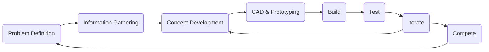

# Following the Engineering Process

The engineering process is nothing new to the engineers in the audience. It is nothing more than a systematic approach to solving a problem.

Start with the Problem Definition and Information Gathering. This is done through watching the game animation, reading the game manuals, and figuring out your strategy. [how to do this](./)
